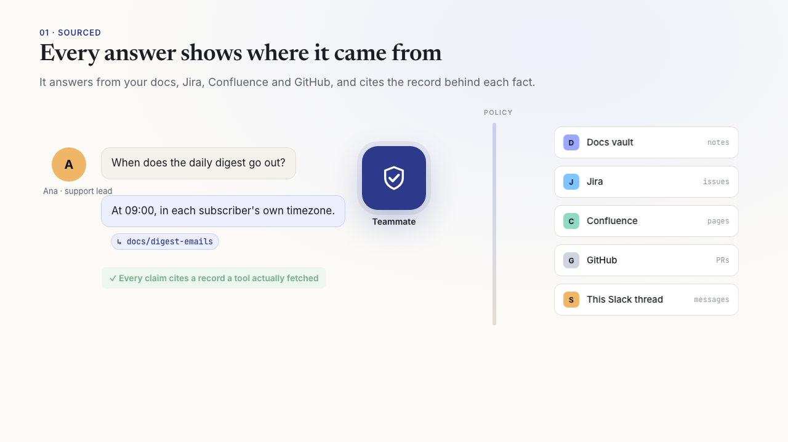
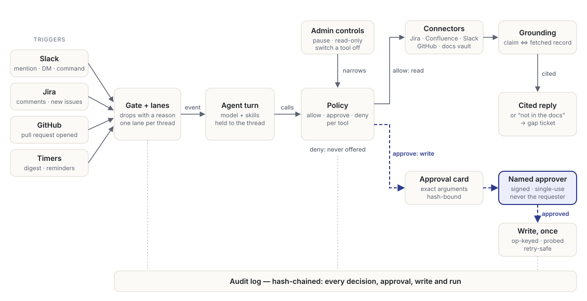

<p align="center">
  
</p>

<h1 align="center">scriptorium</h1>

<p align="center">
  <strong>The open-source AI teammate for Slack, Jira, Confluence and GitHub that shows its receipts.</strong><br>
  A source for every answer. A named person's sign-off for every change.
  A record nobody can quietly edit.
</p>

<p align="center">
  <a href="https://github.com/sloweyyy/scriptorium/actions/workflows/ci.yml"></a>
  <a href="https://github.com/sloweyyy/scriptorium/actions/workflows/mutation.yml"></a>
  <a href="LICENSE"></a>
  
  
</p>

<p align="center">
  <a href="https://scriptorium-teammate.vercel.app">Website</a> ·
  <a href="#quick-start">Quick start</a> ·
  <a href="docs/security-model.md">Security model</a> ·
  <a href="docs/runbook.md">Runbook</a> ·
  <a href="docs/extending.md">Extending</a>
</p>

---

AI assistants fail in three ways people remember: they state things nobody wrote down, they do
things nobody approved, and they misreport what happened. Most are trusted by prompt, so their
rules hold only as well as the model follows them. scriptorium enforces them in code. Every tool call passes one policy check, every write waits
on an approval card for a listed person, and every factual claim must cite a record a tool
actually fetched. Each of those rules has a mutation test that breaks it on purpose and must
be caught.

<p align="center">
  <a href="https://scriptorium-teammate.vercel.app/demo/">
    <picture>
      <source media="(prefers-color-scheme: dark)" srcset="site/demo/poster.png">
      
    </picture>
  </a><br>
  <sub><a href="https://scriptorium-teammate.vercel.app/demo/">▶ Watch the 80-second demo</a>: cited answers, gaps that become tickets, approvals, and docs that learn with permission.</sub>
</p>

<p align="center">
  
</p>

## Why scriptorium

- **Nothing changes without a person.** Writes are approve-tier. An approval is signed,
  single-use, and bound by hash to the exact arguments shown on the card. The person who asked
  can't approve their own request, even from another surface.
- **Answers you can check.** Answers cite Jira issues, Confluence pages, pull requests, Slack
  messages and docs. A claim with no fetched record behind it is refused, and the gap becomes
  a ticket.
- **Runs on your infrastructure.** One container and a folder of files. Files and git are the
  system of record, so there's no database to run. It works with the Anthropic API, Claude on
  Vertex, or Gemini.
- **Built to be operated.** Admins get a kill switch, spend caps and rate-limit backoff. The
  audit log is hash-chained, a run viewer shows what each answer did and cost, `/metrics` feeds your dashboards, and turns cut
  off by a restart are closed honestly.

## What it can do

| | |
|---|---|
| **Answer** | Cited answers across your docs, Confluence, Jira and GitHub · channel catch-up ("what did I miss?") · sprint reports · epic status updates · weekly digest |
| **Act, with approval** | Thread → Jira ticket (also a message shortcut) · move, assign, label and link issues · Confluence pages · PR comments · reminders · several changes on one card as a plan |
| **Watch** | Triage new tickets (readiness and likely duplicates) · readiness check when a ticket is assigned to it · automatic PR checks against their ticket · stale-doc notices |
| **Remember** | Team memory it keeps only when a person approves it, scoped to a person, a channel or everyone, and set to expire. `/teammate memories` shows what applies to you, and `/teammate forget` removes your own at once · 👎 on an answer flags it for review as a test case |
| **Surfaces** | Slack mentions, DMs, `/teammate`, App Home approvals inbox · Jira mentions, assignments, new issues · GitHub PR webhooks · a read-only MCP server for your editor |

Skills are plain markdown in [`skills/`](skills/), and an agent is configuration, not a new bot.
The docs pipeline that started the project, **Scribe** and **Curator**, is described in
[docs/docs-pipeline.md](docs/docs-pipeline.md). Scribe drafts user docs from PRDs on Jira,
behind a human gate. Curator organizes a vault and answers in Slack.

## Guarantees, and where they live

| Guarantee | Enforced in |
|---|---|
| Every tool call passes one policy check; unlisted tools are denied and never offered | `packages/policy` (`runUnderPolicy`, `guard`), `packages/runtime/src/agent.ts` |
| An approval belongs to a listed person, is signed and single-use, and covers only the exact arguments shown | `packages/policy/src/approvals.ts`, `packages/core/src/signing.ts` |
| The requester can't approve, across Slack, Jira and GitHub identities | `packages/policy/src/policy.ts` (`samePerson`) |
| No citation, no claim, for docs, `confluence:`, `jira:`, `github:` and `slack:` records | `packages/curator/src/qa-contract.ts` |
| A write happens once, even after a lost response or a restart | `packages/runtime/src/effects.ts` and op-keys in every connector |
| Reads are allow-listed too, and the model writes words, never JQL or CQL | `packages/connectors` |
| It reads only the conversation it was asked in, and a plan can't escape that | `apps/agents/src/teammate.ts` (`turnRefusal`) |
| Paused, read-only or a tool switched off applies at once; a control file that fails means paused | `apps/agents/src/teammate-bot/control.ts` |
| The audit log detects an edited, removed or reordered line | `packages/core/src/audit.ts` |

The full threat model, layer by layer with the eval behind each control, is in
[docs/security-model.md](docs/security-model.md).

## Quick start

You need Node 22+, pnpm, a model provider key, and a Slack workspace where you can install an
app.

```bash
git clone https://github.com/sloweyyy/scriptorium.git
cd scriptorium
pnpm install
cp .env.example .env
```

1. **Pick a model.** Set `ANTHROPIC_API_KEY`, or `LLM_PROVIDER=gemini` with
   `VERTEX_PROJECT_ID`. `MODEL` picks the model.
2. **Create the Slack app.** Go to https://api.slack.com/apps → *Create New App* →
   *From a manifest*, and paste [`slack-manifests/teammate.yaml`](slack-manifests/teammate.yaml).
   Install it. Then set these in `.env`:
   - `TEAMMATE_SLACK_BOT_TOKEN`: the bot token (`xoxb-…`);
   - `TEAMMATE_SLACK_APP_TOKEN`: an app-level token with `connections:write` (`xapp-…`);
   - `TEAMMATE_SLACK_CHANNELS`: the channels it may answer in;
   - `TEAMMATE_APPROVERS`: who may approve its writes.
3. **Connect your tools (optional).** Jira and Confluence use `JIRA_BASE_URL` plus a service
   account in `TEAMMATE_ATLASSIAN_EMAIL` and `_TOKEN`; without one, they are read-only. GitHub
   uses `TEAMMATE_GITHUB_APP_ID`, `_KEY` and `_REPOS`.
4. **Run it.**
   ```bash
   pnpm dev
   ```
   `/invite @Teammate` in an allowed channel, then ask `@Teammate what does our digest do?`
   or `/teammate help`.

Run `pnpm doctor` to check the setup: it names anything missing (a scope, a channel the bot
isn't in, no approvers, an unsigned or ephemeral audit trail) and how to fix it.

Every setting fails closed: unset means *less* is allowed. The [runbook](docs/runbook.md)
lists the settings that decide safety, how to check a deploy works, and what to do when
something goes wrong.

## Deploy

```bash
docker build -t scriptorium .
docker run --env-file .env -p 8080:8080 scriptorium
```

Run a single instance, with state on a persistent volume. [docs/deploy.md](docs/deploy.md)
covers Cloud Run, model providers, and where Scribe publishes: a public docs repo and a
private vault repo.

## Architecture

| Path | What it owns |
|---|---|
| `packages/policy` | Tiers, signed approvals bound to an args hash, approver rules, separation of duties, multi-step plans |
| `packages/runtime` | Events, the gate, one lane per conversation, exactly-once effects, the fail-closed model loop, memory, budgets |
| `packages/connectors` | Jira, Confluence, Slack and GitHub as allow-listed tools; the Slack approval card |
| `packages/curator` | The vault: organizing, hybrid retrieval (BM25 plus embeddings), the grounding contract |
| `packages/scribe` | Docs from PRDs: contract, draft, lint, revise, publish; house rules |
| `packages/jira` | REST client, wiki-markup translation, comment commands |
| `packages/core` | Model clients, the vault, config, signing, the hash-chained audit log, rate-limit backoff |
| `apps/agents` | The surfaces: the Slack Teammate, the Jira poller and webhooks, App Home, reminders, admin controls, the MCP server |
| `skills/` | What agents know how to do, as reviewable markdown |
| `evals/` | A check for every guardrail |

[docs/architecture.md](docs/architecture.md) has the invariants, and
[docs/extending.md](docs/extending.md) shows how to add a skill, a tool, a connector or an
agent.

**MCP.** `pnpm mcp` serves the vault read-only over stdio for Claude Code, Claude Desktop or an
IDE: `claude mcp add scriptorium -- pnpm --dir /path/to/scriptorium mcp`.

**Tracing.** Every reply ends with its run id. `pnpm trace <run>` shows what that run did:
the trigger, policy decisions, tool calls, approvals, the reply, and what it cost.

## Development

```bash
pnpm typecheck            # strict TypeScript, no build step (tsx runs source)
pnpm eval                 # 500+ deterministic checks, no API key needed
RUN_LLM_EVALS=1 pnpm eval # plus live checks: grounded Q&A, red team, answer golden set per model
pnpm mutate               # sabotage each of 132 guardrails; its eval must catch it
pnpm auditlog verify      # the audit log's hash chain holds
```

CI runs typecheck and evals on Node 22 and 24, and mutation testing weekly. A behavior change
comes with an eval that fails without it. A new safety control also gets a mutant in
[`scripts/mutate.ts`](scripts/mutate.ts).

## Contributing

Issues and pull requests are welcome. See [CONTRIBUTING.md](CONTRIBUTING.md). Sample content is
the fictional "Beacon" product. Please keep real company or customer content out of the repo
and the vault.

Found a security issue? Please follow [SECURITY.md](SECURITY.md) instead of opening a public
issue.

## License

[MIT](LICENSE)
